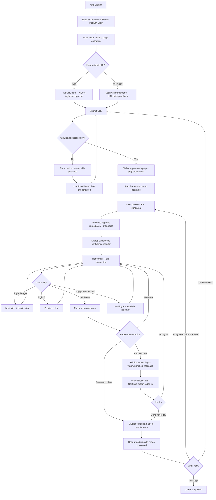
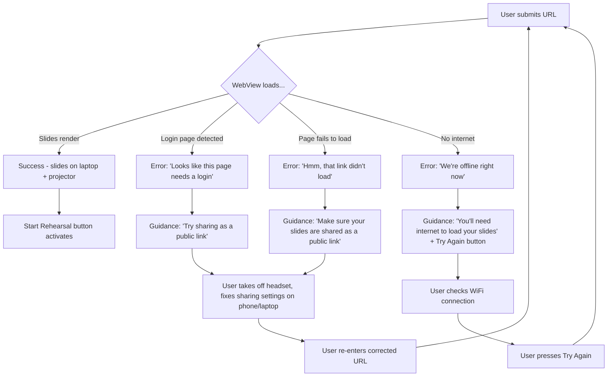
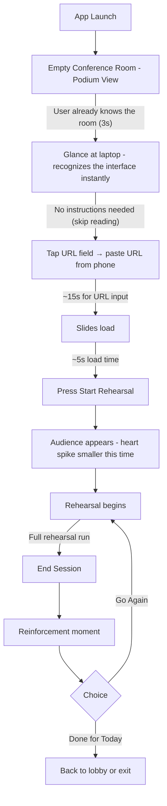
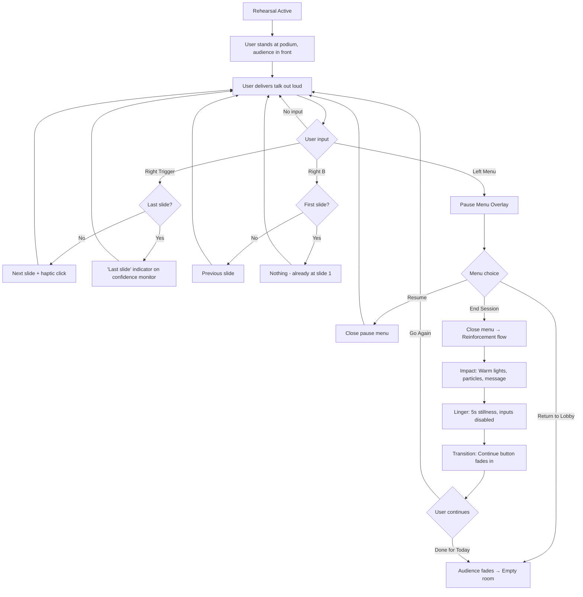

# UX Design Specification — StageMind

**Author:** Dominik
**Date:** 2026-03-29

---

## Executive Summary

### Project Vision

StageMind is a VR presentation rehearsal simulator for Meta Quest 3 that builds speaker confidence through spatial familiarity and positive reinforcement — not coaching, scoring, or analytics. The app provides two connected spaces: a lobby where users load their slides via an embedded browser, and a stage where they rehearse in front of a static audience. The core UX thesis is that the brain doesn't need feedback; it needs the memory of having been on that stage before, and that memory needs to feel good.

The product's emotional design direction is **calm and positive from first interaction.** Every visual, every interaction, every piece of text should communicate warmth, encouragement, and simplicity. The post-session positive reinforcement is the "cherry on top" of an already warm experience — not the only moment of positivity.

Competitor reference: VirtualSpeech offers 12 room types, AI coaching, speech scoring, and subscription pricing. StageMind deliberately offers one room, zero feedback, and a one-time purchase. The radical simplicity and positive emotional tone are the differentiators, not limitations.

### Target Users

**Primary — Alex (The Occasional Speaker):** 20-40 year-old professional who speaks publicly 1-2 times per year. High anxiety, low frequency. Owns a Quest but isn't a VR power user. Doesn't want coaching — wants the spatial experience of standing on the stage with their own slides. Success = walking onto the real stage thinking "I've been here before."

**Secondary — Priya (Zero-Context First-Time User):** Has never used VR. Picks up a shared Quest in a meeting room with zero product awareness. Must understand how to load slides and start rehearsing from the lobby landing page alone, with no onboarding tutorial.

**UX Skill Level Assumption:** Target users have zero VR experience. All interactions must be as flat and obvious as possible — no VR-native patterns, no gesture-based interactions, pure point-and-click simplicity.

### Key Design Challenges

1. **VR text input for zero-experience users** — URL entry via VR keyboard is the highest-friction interaction in the app and the first thing users must do. QR code scanning (MVP candidate) becomes critical to mitigate this for users who have never interacted with a VR keyboard.

2. **Zero-context onboarding** — The lobby landing page is the entire onboarding experience. No tutorial, no walkthrough. A user who has never worn a VR headset must understand "load slides → Start → rehearse" from visual cues and a single page of clear instructions.

3. **Warm tone without being patronizing** — The app must feel like a supportive friend, not a life coach or a gamified wellness app. Encouraging language, warm lighting, calm visual design — consistent from first launch through post-session reinforcement.

4. **Spatial comfort for VR newcomers** — Static viewpoint with no locomotion, but environment proportions, lighting, and scale must feel real enough to trigger useful spatial presence without overwhelming a first-time headset user.

### Design Opportunities

1. **Lobby as empty venue** — Using the same conference room environment for both lobby and stage (audience absent vs. present) creates spatial continuity, reduces cognitive load, strengthens the "I've been here before" memory, and simplifies the scene transition to "the audience appears."

2. **Warm atmosphere as competitive differentiator** — Where competitors look clinical and professional, StageMind can differentiate through warm lighting, calm color palettes, and encouraging language — directly serving the anxiety-reduction thesis.

3. **Radical simplicity as brand** — Two scenes, two actions, zero accounts, zero scores. The deliberate absence of complexity is the UX strategy. Every design decision is filtered through: does this add warmth or add clutter?

## Core User Experience

### Defining Experience

The core experience is **standing on a virtual stage with your own slides and running through your talk.** Everything before that moment — the lobby, the browser, the URL input — is setup cost that must be minimized ruthlessly. The product delivers value the instant the user is on stage with slides loaded. Every second of setup is friction working against the "time to stage" metric.

**Core loop:** Load slides → Start → Rehearse → Positive reinforcement → Go Again or Done.

**During rehearsal, the experience is fully immersive.** No persistent UI, no floating panels, no HUD elements. Just the room, the audience, the slides, and the podium with the confidence monitor. The user is *on a stage,* not *in an app.* Interface access is available through a pause menu triggered by the standard Quest menu button.

### Platform Strategy

| Aspect | Decision |
|--------|----------|
| **Platform** | Meta Quest 3 standalone (APK via Quest Store) |
| **Engine** | Unity + OpenXR |
| **Input** | Meta Quest Touch Plus controllers — point-and-click only, no gestures |
| **VR Experience Level** | Zero. All interactions must be as flat and obvious as possible. |
| **Network** | Required for WebView slide loading; app itself is standalone |

**Controller Mapping (3 buttons total):**

| Action | Button | Rationale |
|--------|--------|-----------|
| Advance slide | Right trigger (index finger) | Natural clicker motion — mimics a real presentation remote |
| Previous slide | Right B button | Secondary action, easy to reach without changing hand position |
| Pause menu | Left menu button | Standard Quest convention — universally expected to open a pause/menu overlay |

The controller mapping is intentionally minimal. A zero-experience user holds the controller, their index finger naturally rests on the trigger, and clicking it advances the slide. This mirrors the physical presentation clicker they'd use on a real stage. A subtle haptic click on trigger pull reinforces the clicker metaphor and gives tactile confirmation that the slide advanced.

**Controller Discoverability:** Before "Start Rehearsal" in the lobby, the laptop screen displays a brief controller diagram showing the three mapped buttons: "Trigger = Next Slide, B = Previous, Menu = Pause." Three seconds of learning, then the user is off. No tutorial, no walkthrough — just a clear visual reference available when they need it.

**Quest Menu Button Intercept:** The left Menu button must be explicitly intercepted at the app level via the Oculus Integration SDK to show StageMind's custom pause overlay. Quest's default behavior surfaces the system menu — the app must override this with its own pause screen.

### Stage Setup — Podium and Confidence Monitor

A podium with a laptop sits at the speaker's position on stage. The laptop screen functions as a **confidence monitor**, displaying the current slide facing the speaker so they never need to turn around to check the projector screen. This mirrors real conference stage setups where speakers glance down at their laptop or a floor monitor rather than turning to face the projection screen.

**Laptop angle optimization:** The laptop is tilted 20-30° above a realistic flat podium surface. In VR, a flat laptop requires significant head tilt downward, which pulls the user's gaze away from the audience and encourages podium-staring (a bad presenting habit). The elevated angle allows a quick glance to catch the current slide without losing the audience sightline. Close enough to feel realistic, ergonomically optimized for VR comfort.

**Technical implementation:** The WebView renders to a single `RenderTexture` shared between the projector screen mesh (facing the audience) and the laptop screen mesh (facing the speaker). One WebView instance, two display surfaces, negligible additional GPU cost.

**Input surface clarity:** In lobby mode, the laptop is the sole interactive surface — the user points at the laptop to click, type, and scroll. The projector screen is a passive mirror only (displays the same content at larger scale but does not receive input). In rehearsal mode, neither surface is interactive — both simply display the current slide. This prevents "I clicked on the projector screen and nothing happened" confusion.

**Dual-display behavior across modes:**

| Mode | Projector Screen (behind speaker) | Laptop on Podium (facing speaker) |
|------|-----------------------------------|-----------------------------------|
| **Lobby** | Passive mirror — large-scale view of browser content | Interactive — browser with landing page, URL input, controller diagram |
| **Rehearsal** | Shows slides to audience (non-interactive) | Shows current slide to speaker as confidence monitor (non-interactive) |

**Post-MVP consideration:** The podium is the right spatial anchor for MVP — it grounds the user and matches the most common conference setup. However, not all talks happen behind a podium. Many tech talks involve stage-walking and free movement. A future podium-free mode with the confidence monitor on a side table or floating nearby would support different presentation styles and prevent the podium from becoming a crutch that teaches speakers to hide.

### Lobby as Empty Venue

The lobby is the **same conference room environment as the stage, but without the audience.** The user stands in an empty room with the podium, laptop, and projector screen already in place. The spatial layout is identical — same walls, same lighting, same stage position.

This design choice serves multiple purposes:

- **Spatial continuity:** The user is already in the room where they'll perform. No teleportation, no scene confusion.
- **Subconscious confidence message:** "You arrived early. You're setting up. You're prepared."
- **Simplified transition:** "Starting" the rehearsal means the audience appears, not that you travel somewhere new.
- **Reduced development scope:** One environment with two states (audience present/absent) rather than two separate scenes.

**Lobby interaction flow:**

1. User launches app → lands in the empty conference room at the podium
2. Laptop on podium shows the landing page with slide loading instructions and controller diagram
3. Projector screen mirrors the laptop content at a larger scale (passive, non-interactive)
4. User points at the laptop to interact with the browser (type URL, navigate)
5. Slides load and appear on both the laptop and the projector screen
6. User presses "Start Rehearsal" → audience appears immediately → rehearsal begins

### Pause Menu

The pause menu provides an escape hatch without cluttering the immersive rehearsal experience. Triggered by the standard Quest menu button (left controller), it presents a simple overlay:

- **Resume** — return to rehearsal
- **End Session** — triggers the positive reinforcement flow
- **Return to Lobby** — skip reinforcement, go back to browser/slide loading

No "Restart" option. Slide reset is handled naturally: the user navigates back to slide 1 manually using the B button, mirroring real presenter behavior before a talk.

### Effortless Interactions

| Interaction | Design Goal | Approach |
|-------------|-------------|----------|
| **Slide loading** | "Paste URL and go" within 2 minutes (first-time) / 1 minute (returning) | Landing page with clear instructions, browser with URL input, QR code scanning as MVP candidate |
| **Slide advancing** | Zero thought — index finger click with tactile confirmation | Right trigger with haptic feedback, mimicking a physical presentation clicker |
| **Checking current slide** | Natural glance, no head-turning | Laptop confidence monitor on podium, tilted for comfortable VR viewing angle |
| **Pausing** | Standard Quest convention | Left menu button → pause overlay |
| **Ending a session** | Intentional, not accidental | Pause menu → "End Session" → positive reinforcement |
| **Starting over** | Natural reset, like real life | Navigate back to slide 1 with B button — mirrors real presenter behavior |
| **Learning controls** | Instant, no tutorial | Controller diagram on laptop screen before "Start Rehearsal" |

### Critical Success Moments

1. **"I'm on a stage"** — The instant the user looks up from the laptop and sees 50 people looking at them. Heart rate spikes. Spatial presence kicks in. This is the product delivering its core promise.

2. **"My slides are right there"** — The user glances down at the podium laptop and sees their actual slide. Glances behind and sees the projector screen. The spatial relationship clicks: "This is exactly like a real conference setup."

3. **"I can just... click through"** — The user pulls the trigger, feels the haptic click, and the slide advances. No learning curve, no confusion. The clicker metaphor is instantly understood.

4. **"That felt good"** — Post-session positive reinforcement. Warm lighting shift, affirming message, gentle visual effect. The user takes off the headset thinking "I should do that again."

5. **"Wait, I already know how this works"** — The returning user (Journey 4) launches the app after months away and is rehearsing within a minute. The stateless lobby and minimal interaction model mean there's almost nothing to remember.

### Experience Principles

1. **Warmth over precision** — Every design decision prioritizes emotional warmth and encouragement over analytical precision. The app should feel like a supportive friend, never like a judge or a coach.

2. **Invisible interface** — During rehearsal, the interface disappears. The user is on a stage, not in an app. Setup UI exists only in the lobby and the pause menu.

3. **Real-world spatial metaphors** — Podium, laptop, projector screen, audience seating — everything maps to real conference room elements. No floating panels, no VR-native abstractions during the core experience.

4. **Three-button simplicity** — Trigger to advance, B to go back, Menu to pause. If an interaction can't be mapped to these three inputs, it doesn't belong in MVP.

5. **Setup cost is the enemy** — Every second between "app launches" and "I'm rehearsing" is friction that must be eliminated or minimized. The "time to stage" metric governs all lobby UX decisions.

## Desired Emotional Response

### Primary Emotional Goals

StageMind exists to execute a single emotional transformation: **anxiety → familiarity → quiet confidence.** The user arrives anxious about an upcoming talk. Through repeated spatial exposure in a warm, judgment-free environment, they build the subconscious memory of "I've done this before." They leave feeling ready — not because they were told they're ready, but because standing on the stage stopped feeling scary.

**Primary emotion:** Quiet confidence — the calm that comes from familiarity, not from praise.

**Supporting emotions:** Warmth (the app is on your side), ease (nothing here is hard), accomplishment (you did the thing), and safety (no judgment, no scores, no audience of critics).

**Emotions to avoid:** Judgment, evaluation, performance pressure, clinical detachment, infantilization, gamification pressure ("do more! score higher!").

### Emotional Journey Mapping

The emotional journey spans not just a single session but the arc across multiple sessions. The first time, the heart spike is intense and the relief is huge. By the third session, the spike is smaller and focus shifts from survival to craft. By the fifth, there's no spike at all — and that quiet absence is the moment of true transformation.

**Single-Session Journey:**

| Moment | Arriving Emotion | Target Emotion | Design Lever |
|--------|-----------------|----------------|--------------|
| **Opening the app** | Nervous hope | Calm welcome — "this feels friendly" | Warm environment, gentle lighting, encouraging landing page text |
| **Loading slides** | Task focus, possible friction | Purposeful preparation — "I'm setting up my stage" | Lobby-as-empty-venue framing; you arrived early, you're getting ready |
| **Audience appears** (first time) | Heart spike, vulnerability | Productive adrenaline — "this feels real" | Immediate appearance. The involuntary stress response IS the product working. |
| **Mid-rehearsal** | Self-consciousness, stumbling | Growing focus — "I'm getting through this" | No feedback, no scoring, no interruptions. Just the stage. |
| **Post-session reinforcement** | Relief, self-critique tendency | Warm accomplishment — "I did it" | Warm lighting shift, affirming message, gentle visual effect. Lingers until user chooses to continue. |
| **Going again** | "I want to try that part again" | Ease — "this is just practice" | Navigate back to slide 1 with B button, no penalty, no reset of any state |
| **Something goes wrong** (error) | Frustration, confusion | "No big deal, let's fix this" | Warm, human error messages on the laptop screen with clear next action. Never blame the user. |
| **Returning months later** | "Do I remember how this works?" | Instant familiarity — "I know this place" | Identical lobby, identical flow. Nothing to re-learn. |
| **On the real stage** | Performance nerves | "I've been here before" | The transferred spatial memory — the ultimate product success signal |

**Internal Monologue Alignment:** Reinforcement messages must mirror what the user is already starting to tell themselves. The message validates and amplifies an emerging thought — it never introduces an idea the user doesn't believe yet. "You're more ready than you think" works because the user is already half-thinking "maybe I'm actually getting better at this." Messages that outpace the user's self-perception ("You're a star!") feel hollow and patronizing.

### Audience Appearance — The Heart-Spike Moment

When the user starts a rehearsal, the audience appears **immediately** — no gradual fade-in, no animation. One moment the room is empty; the next, 50 people are seated and looking at the speaker. This produces an involuntary stress response that mirrors the real experience of walking onto a stage and facing an audience.

This heart spike is not a bug — it's the product's mechanism of action. The brain processes the spatial pressure as genuine, which is what makes repeated exposure therapeutically effective. Softening this moment would reduce the spatial impact and weaken the confidence-building effect.

**Post-MVP enhancement:** Walking-in animations for audience members, creating a more dynamic "the room is filling up" experience. Not critical for the anxiety-reduction mechanism but adds environmental richness.

### Micro-Emotions

| Micro-Emotion Pair | Target State | How We Achieve It |
|--------------------|-------------|-------------------|
| **Confidence vs. Confusion** | Confidence | Three-button controller map, controller diagram before start, self-explanatory lobby landing page |
| **Trust vs. Skepticism** | Trust | No accounts, no data collection, no surprises. The app does exactly what it says. |
| **Accomplishment vs. Frustration** | Accomplishment | Every completed run-through triggers positive reinforcement. There is no failure state. |
| **Ease vs. Overwhelm** | Ease | One room, one flow, one action at a time. Radical simplicity prevents cognitive overload. |
| **Safety vs. Judgment** | Safety | No scores, no analytics, no coaching. The app never evaluates you. |

### Post-Session Reinforcement Design

The post-session reinforcement moment is the emotional capstone of each rehearsal. It must feel earned but not evaluative — celebrating completion, not performance.

**Three-Phase Sequence:**

1. **Impact (0–1s):** Stage lights shift to warm golden/amber. Audience fades. Soft warm-toned particles or light motes drift upward with graceful, slow-float physics. An affirming message appears in clean typography. Controller mapping changes — trigger and menu button are disabled to prevent accidental inputs from disrupting the emotional moment.

2. **Linger (1–5s):** Nothing changes. The user stands in the warm space with the message. No animations starting, no buttons appearing, no visual movement drawing attention. Just stillness. This is the exhale moment — the most important phase because most apps skip it. Stillness communicates: "There's no rush. This moment is for you." Five seconds rather than three because VR time perception runs differently — the user needs time to register the spatial shift (lights changing, audience disappearing) AND settle into the feeling.

3. **Transition (after ~5s):** A subtle "Continue" button gently fades in. Not urgent, not demanding attention — just available. If the user doesn't act, the warm space persists indefinitely. They can savor the moment as long as they want. On continue: "Go Again" and "Done for Today" options appear.

**Reinforcement Message Pool:**

Messages rotate randomly from a pool that spans different stages of the confidence journey. No session tracking — random rotation naturally serves users wherever they are emotionally. The pool contains messages for early-stage users ("You showed up. That's what matters.") and experienced users ("The stage knows you now.") alike.

| Message | Emotional Stage It Serves |
|---------|--------------------------|
| "You showed up and ran through it. That counts." | Early — validating the act of trying |
| "Another run in the books. You're more ready than you think." | Mid — acknowledging growing competence |
| "Practice doesn't have to be perfect. You showed up. That's what counts." | Early/Mid — normalizing imperfection |
| "That's another rehearsal done. The stage knows you now." | Later — reflecting earned familiarity |
| "Every time you stand here, the real stage feels a little more like home." | Later — connecting rehearsal to transfer |

Every message must pass the **"Would the user already be half-thinking this?" test.** If yes, it validates and amplifies. If no, it patronizes.

**What the reinforcement is NOT:**
- Not "Congratulations!" (corporate, evaluative)
- Not audience applause (feels cheap and performative)
- Not a score or rating (contradicts the no-judgment principle)
- Not gamified (no streaks, no badges, no points)
- Not aspirational beyond the user's current self-perception

**"Done for Today"** — This exact button label is intentional. Not "Quit" or "Exit." "Done for Today" implies you'll be back. It's a small narrative promise embedded in a UI element.

### Error State Emotional Design

Error states maintain the same warm, supportive tone as the rest of the experience. The app never shifts to clinical system language when something goes wrong.

**Error design principles:**

1. **Never blame the user** — "That link didn't work" not "Invalid URL"
2. **Always show the next step** — every error includes a clear action to recover
3. **Stay in the environment** — errors appear on the laptop screen, not as floating popups
4. **Keep it human** — conversational language, not system messages

**Example error messages:**

| Situation | Message | Next Action |
|-----------|---------|-------------|
| URL doesn't load | "Hmm, that link didn't load. Make sure your slides are shared as a public link." | Link to instructions on the landing page |
| Login wall detected | "Looks like this page needs a login. Try sharing your slides as a public link instead." | How-to steps visible on screen |
| No internet | "We're offline right now. You'll need internet to load your slides." | "Try Again" button |
| WebView crash | "Something went wrong. Let's try loading that again." | "Reload" button |

### Emotional Design Principles

1. **The app is on your side** — Every piece of text, every visual choice, every interaction communicates: "We're here to help you feel ready." There is no adversarial relationship between the app and the user.

2. **Completion is the only metric** — The app celebrates that you did a run-through. Not how well you did it, not how many filler words you used, not your pacing. You stood on the stage and went through your slides. That's a win.

3. **Anxiety is expected and respected** — The heart spike when the audience appears is not smoothed over or apologized for. It's the point. The app's job is to let you feel that spike in a safe context until it becomes manageable.

4. **Errors are detours, not failures** — When something goes wrong, the tone stays warm. The user never feels like they broke something or did something wrong.

5. **Silence is supportive** — During rehearsal, the app is completely silent (no UI, no feedback, no interruptions). The absence of judgment IS the support.

6. **Stillness is design** — The linger phase of post-session reinforcement is not dead time. It's the most intentional moment in the app — a deliberate pause that says "this moment matters."

## UX Pattern Analysis & Inspiration

### Inspiring Products Analysis

**VirtualSpeech (Direct Competitor)**

[VirtualSpeech](https://virtualspeech.com/practice/presentation-skills) is the closest existing product — a VR/web presentation training platform with 12 venue types, AI-powered feedback, body language scoring, and subscription pricing.

| Pattern | Assessment | StageMind Application |
|---------|-----------|----------------------|
| 12 venue types with card-based selector | Good UX pattern | Adopt selector pattern for post-MVP venue expansion |
| "Add your slides and notes" — slide integration | Validates user expectation | Confirms "bring your own slides" is the right approach |
| AI feedback on speech, body language, pacing | Core anti-pattern for StageMind | Deliberately avoid — this is coaching, not rehearsal |
| Audience distractions toggle | Good post-MVP feature | Adapt for future audience behavior customization |
| Subscription pricing with enterprise tiers | Opposite business model | Validates the gap StageMind fills: one-time purchase for occasional speakers |
| Web + VR dual platform | Different approach | VR-only for MVP; confirms web companion as potential future path |

**Beat Saber (VR Interaction Reference)**

The gold standard for VR onboarding. Mechanics are understood instantly: see blocks, hold sabers, swing. No tutorial, no explanation — the spatial context IS the instruction. StageMind's parallel: see podium, see laptop, point and click. The environment teaches the interaction.

**Meta Quest Home Environment (Spatial Design Reference)**

The Quest home environment is a space you exist in — warm, minimal, comfortable. StageMind's lobby follows the same pattern: you're not looking at a menu, you're standing in a room. The environment IS the interface.

**Meta Quest Passthrough / Extended Reality (Groundedness Reference)**

The preference for passthrough reveals a core aesthetic value: **groundedness over escapism.** StageMind's stage environment should feel like a real room that happens to be virtual, not a virtual world pretending to be real. Architectural realism, natural materials, plausible lighting — the uncanny valley to avoid is "too perfect" or "too game-like," not "too real."

**Headspace / TRIPP (Emotional Tone Reference)**

Meditation and wellness VR apps demonstrate that warm, calm, positive emotional tone is achievable in digital products. Headspace in particular nails the "supportive friend" voice in its copy and visual design — approachable minimalism, warm colors, encouraging without being patronizing. StageMind's copy voice should follow this model.

### Visual Design Direction — Natural Minimalism

The defining aesthetic for StageMind is **natural minimalism** — inspired by linen fabric in natural tones, bright wood, and the warmth of organic materials. This is not merely an aesthetic preference — it's a psychological design choice. Research in environmental psychology shows that natural materials and warm tones reduce cortisol levels. The room itself does therapeutic work before the user even loads a slide.

**Plausibility Principle:** The room must feel like the **best version of a real conference room** — the kind of space you'd find at a nice modern coworking space. Aspirational enough to feel good to be in, realistic enough that the spatial memory transfers to real venues. If the environment is too curated (architecture magazine), it won't map to real presentation spaces. If it's too generic (corporate hotel ballroom), it won't feel warm.

Brand comparison anchor: **WeWork, not Regus.** Modern, warm, natural materials, designed with intention — but unmistakably a functional workspace.

**Material Palette:**

| Element | Material / Texture | Notes |
|---------|-------------------|-------|
| **Podium** | Light oak or birch wood, natural grain visible | Warm, organic, not corporate. Higher-res texture — user stands directly next to it. |
| **Stage floor** | Light wood or warm-toned matte surface | Grounded, not glossy or reflective |
| **Walls** | Warm neutral — cream, soft linen tone, matte | Not white (clinical) and not dark (oppressive). Warm and enveloping. |
| **Seating** | Upholstered in warm neutral fabric with darker tones | Audience chairs should look sat-in, not showroom. Slightly darker upholstery provides depth contrast. |
| **Carpet / floor accent** | Warm charcoal or deep brown | Grounding dark element — prevents the room from feeling floaty in VR and provides spatial depth cues. |
| **Laptop** | Simple, modern, neutral casing | Not branded. Just a screen on the podium. Higher-res texture for close proximity. |
| **Projector screen** | Clean white with subtle frame | Standard conference screen — nothing fancy. Lower-res acceptable (viewed from distance). |

**Color Palette:**

| Role | Color Direction | Hex Range Reference |
|------|----------------|-------------------|
| **Primary background** | Warm cream / natural linen | #F5F0E8 – #EDE6D6 |
| **Wood tones** | Light oak / birch | #C8A96E – #D4B87A |
| **Grounding dark** | Warm charcoal / deep brown (carpet, chair fabric, trim) | #3A3632 – #4A4540 |
| **Text** | Warm dark gray (not pure black) | #3A3632 – #4A4540 |
| **Accent (warm)** | Soft amber — used in post-session lighting shift | #E8B84B – #D4A43A |
| **UI elements** | Muted warm tones, never bright or saturated | Derived from material palette |

**Lighting:**

- **Lobby (empty venue):** Warm, even, gentle ambient light. Like natural light through large windows — bright but not harsh. Communicates: calm, welcoming, "you're early, take your time." Implemented as baked lightmaps for performance.
- **Rehearsal (audience present):** Slightly more directional — subtle stage lighting that creates a sense of "this is a real event" without theatrical drama. Conference room presentation lighting, not spotlights.
- **Post-session reinforcement:** Shift to warm golden/amber via color temperature post-processing effect (low GPU cost). The entire space glows softer.

**Typography:**

- Clean, light-weight sans-serif for all UI text and messages
- Never heavy, aggressive, or stylized
- Reinforcement messages in slightly larger, centered type — not shouting, just clear and present

**Performance Alignment:** The natural minimalism aesthetic is inherently performance-friendly on Quest 3. Matte, diffuse materials require only simple shading — no real-time reflections, no specular highlights, no multi-pass rendering. Baked lighting delivers warm ambience at near-zero runtime cost. The 50-person audience benefits from soft, forgiving lighting that masks lower-poly character geometry. This aesthetic direction directly supports the 72fps performance target.

### Transferable UX Patterns

**Patterns to Adopt:**

| Pattern | Source | StageMind Application |
|---------|--------|----------------------|
| **Environment-as-instruction** | Beat Saber | The lobby teaches itself — podium, laptop, screen. No tutorial needed. |
| **Spatial interface** | Quest Home | The user is IN the interface, not looking AT an interface. Lobby is a room, not a menu. |
| **Warm, encouraging copy voice** | Headspace | Reinforcement messages, landing page text, error messages all follow "supportive friend" voice. |
| **Groundedness over escapism** | Quest Passthrough | The conference room feels like a real place — natural materials, plausible scale, honest lighting. |

**Patterns to Adapt:**

| Pattern | Source | Adaptation for StageMind |
|---------|--------|------------------------|
| **Venue card selector** | VirtualSpeech | For post-MVP venue selection — simple visual grid of room options |
| **Audience customization toggles** | VirtualSpeech | For post-MVP audience behavior — simplified, fewer options, no clinical framing |
| **Calm environment aesthetics** | TRIPP / meditation apps | Adopt the warmth and calm, but ground it in architectural realism rather than abstract/psychedelic |

### Anti-Patterns to Avoid

| Anti-Pattern | Why It's Wrong for StageMind |
|-------------|------------------------------|
| **AI feedback / scoring** | Contradicts the "no judgment" emotional principle. The product is a rehearsal room, not a coaching platform. |
| **Gamification (streaks, badges, leaderboards)** | Creates performance pressure. StageMind has no failure state. |
| **Dark mode / tech-heavy aesthetic** | Contradicts natural minimalism direction. Cold and clinical undermines warmth. |
| **Overly curated "design magazine" environment** | Too perfect breaks spatial transfer. The room must feel plausibly real, not aspirationally beautiful. |
| **Tutorial / onboarding walkthrough** | Adds time before rehearsal. The lobby must be self-explanatory from spatial context alone. |
| **Floating VR UI panels** | Breaks the "real room" spatial metaphor. Everything lives on real surfaces (laptop, projector screen). |
| **Loading screens with tips** | Breaks immersion. Transitions should be spatial (fade to warm, audience appears), not screen-based. |
| **"Welcome back!" returning user flows** | Adds friction for returning users. The lobby is stateless — same experience every time, instantly familiar. |
| **All-light rooms without contrast** | Feels flat and floaty in VR. The brain needs dark grounding elements for spatial depth perception. |

### Design Inspiration Strategy

**Adopt directly:**
- Environment-as-instruction (no tutorials, the room teaches itself)
- Supportive friend copy voice (Headspace-inspired)
- Natural minimalism visual language (linen/wood/warm neutrals with dark grounding)
- Groundedness in architectural realism — plausible, not perfect
- Natural materials for cortisol-reducing environmental psychology

**Adapt for StageMind's context:**
- VirtualSpeech's venue variety → simplified post-MVP selector
- Meditation app warmth → grounded in conference room realism, not abstract
- Beat Saber's instant-understanding mechanics → three-button controller map

**Avoid entirely:**
- AI coaching, scoring, analytics — in any form
- Gamification mechanics — no streaks, badges, or progress tracking
- Dark/tech/corporate aesthetic — contradicts natural minimalism
- Any UI that breaks the "real room" spatial metaphor
- Environments too perfect to feel real — plausibility enables spatial memory transfer

## Design System Foundation

### Design System Choice

**Custom minimal design system built on Unity Canvas (World Space mode).**

StageMind is a VR application with minimal 2D UI surfaces — the design system is not a traditional web/mobile component library but a three-layer consistency framework: 3D environment design, world-space UI, and interaction patterns.

No external design system (Material Design, Ant Design, etc.) applies to this project. The visual language is custom, derived from the natural minimalism direction established in the inspiration analysis.

### Rationale for Selection

| Factor | Decision Driver |
|--------|----------------|
| **Platform** | Unity VR on Quest 3 — no web/mobile UI frameworks apply |
| **UI Surface Count** | Exactly 4 UI contexts (landing page, browser overlay, pause menu, post-session reinforcement). Minimal scope does not justify a complex UI framework. |
| **Team Size** | Solo developer with AI-assisted development — simplest proven approach wins |
| **Brand Requirements** | Custom natural minimalism aesthetic — no existing system matches this direction |
| **Spatial Metaphor** | UI must appear ON physical surfaces (laptop screen, projector screen) — World Space Canvas renders directly onto 3D meshes, preserving the "real room" metaphor |
| **Long-Term Maintenance** | Minimal UI surface area means low maintenance burden. Style guide consistency matters more than component reusability. |

### Implementation Approach

**Three-Layer Design System:**

**Layer 1: 3D Environment Design**

The conference room environment — materials, lighting, proportions, audience models. Entirely custom. Governed by the natural minimalism visual direction:
- Material palette: light oak/birch wood, warm cream walls, neutral fabric seating with darker grounding tones
- Lighting: baked lightmaps for ambient warmth, post-processing color temperature shift for reinforcement moment
- Scale: architecturally plausible proportions matching a real 50-person conference room
- Audience: low-poly character models with decent textures, softened by warm diffuse lighting

**Layer 2: World-Space UI**

2D interface elements rendered on Unity Canvas components placed in world space — mapped to the laptop screen and projector screen meshes. Four UI contexts:

1. **Landing Page** — displayed on the laptop screen in lobby mode. Slide loading instructions, URL input field, controller diagram, "Start Rehearsal" button. Visual hierarchy inverted for VR viewing angle: instructions at top (read first), primary actions at bottom (closest to user standing above the laptop).
2. **Browser Overlay** — the embedded WebView rendering on the laptop (interactive) and projector screen (passive mirror). Browser chrome (URL bar, back/forward/refresh, loading indicator) evaluated during Phase 0 spike — adopt WebView plugin's built-in chrome if it meets style guide; build custom only if needed.
3. **Pause Menu** — overlay that appears when the user presses the menu button during rehearsal. Three options: Resume, End Session, Return to Lobby.
4. **Post-Session Reinforcement** — warm background, affirming message text, "Continue" button that fades in after ~5 seconds, then "Go Again" and "Done for Today" options.

**Layer 3: Interaction Patterns**

Three-button controller mapping with haptic feedback. Point-and-click interaction with world-space UI elements. No gestures, no VR-native interaction patterns. Text input via Quest's native system keyboard (`TouchScreenKeyboard` API) — handles clipboard paste, cursor positioning, and language input. Do not build a custom VR keyboard.

### Customization Strategy

**UI Style Guide — Minimal Tokens:**

| Token | Value | Notes |
|-------|-------|-------|
| **Font Family** | Clean sans-serif (e.g., Inter, Noto Sans) | One family, two weights: Regular (body) and Medium (headings/buttons) |
| **Base Font Size** | ~24-32pt equivalent at arm's length in VR | VR text must be significantly larger than screen text for legibility. Test in-headset. |
| **Text Color** | Warm dark gray #3A3632 | Never pure black — maintains natural minimalism warmth |
| **Background** | Warm cream #F5F0E8 | Consistent with wall tones — UI feels like part of the room |
| **Primary Button** | Rounded rectangle, warm amber fill #D4A43A, dark text | Clear, generous hit target. Minimum 0.08m × 0.04m in world space. Tune empirically in-headset. |
| **Secondary Button** | Rounded rectangle, transparent with warm dark border | Used for less prominent actions |
| **Spacing** | Generous — minimum 16px equivalent padding, 24px between elements | VR UI needs more breathing room than screen UI |
| **Copy Voice** | Supportive friend — conversational, warm, never corporate | Consistent across landing page, errors, reinforcement, and pause menu |

**VR Button Interaction States:**

| State | Visual | Trigger |
|-------|--------|---------|
| **Default** | Normal appearance | No controller ray intersecting |
| **Hovered** | Brightness increase + pointer cursor change | Controller ray intersects button collider |
| **Pressed** | Visual depress + color darken | Trigger pulled while hovered |
| **Released/Activated** | Brief flash or bounce-back to confirm action | Trigger released → action fires |
| **Disabled** | Dimmed, no hover response | Button not available in current context |

The Released/Activated state prevents accidental double-clicks — it gives the user clear visual confirmation that their action registered. During the post-session reinforcement moment, controller mapping changes: trigger and menu button are disabled to prevent accidental inputs.

**Prefab Inventory (Implementation View):**

| Prefab | Configurable Properties | Used In |
|--------|------------------------|---------|
| **TextBlock** | Text content, size toggle (heading/body) | Landing page, reinforcement, errors |
| **PrimaryButton** | Label text | "Start Rehearsal", "Continue", "Go Again", "Resume" |
| **SecondaryButton** | Label text | "Done for Today", "Return to Lobby", "End Session", "Resume" |
| **TextInputField** | Placeholder text, triggers Quest system keyboard | URL input |
| **LoadingIndicator** | Simple spinner or progress bar | WebView loading state |
| **Card** | Background color, accent color | Error states container, future reuse |
| **StatusIndicator** | Text content | Transient feedback ("Last slide") |

Total prefabs: **8.** Controller reference uses text-based labels (TextBlock instances) rather than an image prefab. Error messages use Card container composed with TextBlock children. Landing page, pause menu, and reinforcement screen are Canvas layouts composed of these prefabs — not unique components.

**WebView Plugin Integration Note:** The Phase 0 spike will evaluate what the chosen WebView solution (e.g., Vuplex) provides out-of-the-box for browser chrome (address bar, navigation buttons). If the plugin's default UI meets the style guide, adopt it directly and remove browser chrome from custom component scope. This could reduce the prefab count further.

## Defining Core Experience

### Defining Experience

**"Stand on a virtual stage with your own slides and practice your talk."**

This is StageMind in one sentence — the line users will say to friends. The defining experience is not a gesture, a feature, or an interaction pattern. It's a **spatial state**: standing at a podium, audience in front of you, your actual presentation on the screen behind you, and a clicker in your hand. The product succeeds if that state feels real enough to produce a genuine physiological response (elevated heart rate, heightened awareness) that maps to the real-stage experience.

The defining experience is NOT:
- Loading slides (that's setup cost)
- Advancing slides with the trigger (that's a mechanic)
- Getting positive reinforcement (that's the emotional reward)
- The conference room environment (that's the setting)

It IS: the moment the audience appears, you look up, and your body responds as if you're actually on a stage. That involuntary response is the product delivering its core value.

### User Mental Model

**How users currently rehearse:**

The dominant rehearsal behavior for occasional speakers is **desk mumbling** — sitting at a computer, clicking through slides on a monitor, and quietly talking through the content. Sometimes standing in a living room talking to empty space. Occasionally running through it mentally without even opening the deck.

**What desk rehearsal gives you:**
- Content familiarity — you know what each slide says
- Sequence memory — you know what comes after slide 7
- Rough timing — you have a sense of whether it's 15 or 25 minutes

**What desk rehearsal DOESN'T give you:**
- Spatial pressure — the feeling of standing in front of people
- Scale awareness — the room is bigger than your desk, the screen is behind you not in front of you
- Eye contact challenge — looking at faces rather than a monitor
- Physiological rehearsal — managing the adrenaline, the dry mouth, the shaky hands
- Podium dynamics — the physical relationship between you, your notes, the screen, and the audience

**The gap StageMind fills:** The user walks onto a real stage knowing their content (from desk rehearsal) but having zero spatial familiarity. StageMind provides the spatial rehearsal that desk practice cannot. It doesn't replace desk rehearsal — it completes it.

**Mental model the user brings:** "I'm going to practice my talk, like I do at my desk, but this time it'll feel more like the real thing." The flow should mirror desk rehearsal habits: open slides, start talking, click through. The addition is the environment, not the workflow. Nothing about the rehearsal PROCESS should feel unfamiliar — only the SETTING should feel new.

### Success Criteria

| Criterion | What It Means | How We Know It Worked |
|-----------|---------------|----------------------|
| **Spatial presence** | The user's body responds as if they're actually on a stage | Heart rate elevation, heightened awareness, involuntary attention to the audience |
| **Content flow** | The user can advance through their actual slides naturally | Trigger-click feels like a presentation clicker; slide transitions are fast enough to not break pacing |
| **"I've been here before" transfer** | The spatial memory from VR transfers to the real stage | User reports reduced anxiety on the real stage — measured through subjective feedback, not analytics |
| **Instant re-run** | The user can immediately run through it again | Navigate back to slide 1 manually (mirroring real behavior), press Start, rehearse again |
| **Time to stage** | Setup cost doesn't erode motivation | First-time: < 2 minutes. Returning: < 1 minute. |

### Novel vs. Established Patterns

StageMind's UX is almost entirely established patterns used in a novel context.

| Pattern | Type | Analysis |
|---------|------|----------|
| **Pointing and clicking on a screen** | Established | Standard VR interaction. Users know this from Quest home. |
| **Trigger-as-clicker** | Established metaphor in novel medium | The trigger mimics a physical presentation clicker — familiar from real presentations. |
| **Typing a URL** | Established (but painful in VR) | Mitigated by Quest's native keyboard and QR code scanning. |
| **Environment-as-interface** | Novel for this use case | The lobby is a room, not a menu. Novel for presentation tools but familiar from real life. |
| **Spatial state as product value** | Novel | Most apps deliver value through features. StageMind delivers value through a FEELING. |

**Teaching strategy for the novel pattern:** The environment-as-interface requires no explicit teaching. The lobby landing page on the laptop shows instructions. The controller diagram shows the three buttons. The spatial context (podium, laptop, projector screen) maps to real-world objects. The environment teaches itself.

### Experience Mechanics

**User Spawn Position:** The user spawns at the podium, facing the empty seats, with the laptop in front of them (on the podium) and the projector screen behind them. The natural action is to look down at the laptop, read the instructions, and load slides. Everything happens from this one standing position. When the audience appears, they appear in the user's forward field of view — maximum heart-spike impact.

**Complete Flow — Step by Step:**

**Phase 1: Arrival (0-10 seconds)**

| Step | User Action | System Response |
|------|-------------|-----------------|
| 1 | Launches StageMind on Quest | App opens. Brief loading. |
| 2 | — | User is standing in an empty conference room at the podium. Laptop shows landing page. Projector mirrors laptop. Warm ambient lighting. |
| 3 | Looks around | Empty room, no audience. Warm, natural materials. Calm. "You arrived early." |

**Phase 2: Slide Loading (10 seconds – 2 minutes)**

| Step | User Action | System Response |
|------|-------------|-----------------|
| 4 | Reads landing page on laptop | Instructions: share slides as public link, paste URL. Controller diagram shows three buttons. |
| 5a | Points at URL input field, pulls trigger | Quest system keyboard appears. User types/pastes URL. |
| 5b | (Alternative) Scans QR code from phone | URL auto-populates. |
| 6a | Submits URL — loads successfully | Loading indicator → slides appear on laptop and projector screen. "Start Rehearsal" button becomes active at bottom of laptop. |
| 6b | Submits URL — loads login/error page | Error message card appears on laptop: warm, human guidance explaining how to share as a public link. User fixes link and retries. |
| 7 | (Optional) Navigates slides in browser to verify | Browser interaction via controller pointing on laptop. |

**Phase 3: Transition (1-2 seconds)**

| Step | User Action | System Response |
|------|-------------|-----------------|
| 8 | Points at "Start Rehearsal", pulls trigger | Button press animation + haptic. |
| 9 | — | Audience appears immediately — 50 people seated, facing the speaker. No fade-in. Heart-spike moment. Slide advance input disabled until transition completes. |
| 10 | — | Laptop switches to confidence monitor. Projector shows slides to audience. Controller diagram disappears. Slide advance input enabled. |

**Phase 4: Rehearsal (2-30+ minutes)**

| Step | User Action | System Response |
|------|-------------|-----------------|
| 11 | Delivers their talk out loud | Nothing. Pure immersion. No UI, no feedback. |
| 12 | Pulls right trigger | Next slide. Haptic click. Both screens update. |
| 13 | Presses right B button | Previous slide. Both screens update. |
| 14 | Glances down at podium laptop | Current slide visible as confidence monitor. |
| 15 | Pulls trigger on last slide | Nothing happens. "Last slide" indicator appears briefly on confidence monitor. No auto-end. |
| 16 | (If needed) Presses left Menu button | Pause menu overlay: Resume / End Session / Return to Lobby. |

**Phase 5: Completion**

| Step | User Action | System Response |
|------|-------------|-----------------|
| 17 | Selects "End Session" from pause menu | Pause menu closes. |
| 18 | — | **Impact (0-1s):** Lights shift to warm amber. Audience fades. Warm particles rise. Affirming message. Controller inputs disabled. |
| 19 | — | **Linger (1-5s):** Stillness. Just the warm space and the message. |
| 20 | — | **Transition (~5s):** "Continue" button gently fades in. |
| 21 | Points at "Continue", pulls trigger | Options appear: "Go Again" / "Done for Today" |
| 22a | Selects "Go Again" | Returns to rehearsal. WebView preserved at current slide. User clicks B to navigate back to slide 1 (mirroring real presenter behavior). Audience remains. |
| 22b | Selects "Done for Today" | Returns to lobby (empty room). WebView preserved at current slide. User can navigate slides, load new URL, or exit app. |

**Phase 6: Return to Lobby**

| Step | User Action | System Response |
|------|-------------|-----------------|
| 23 | Selects "Return to Lobby" from pause menu | Audience fades. User is back in empty room. WebView preserved — laptop shows whatever slide the user was on. |
| 24 | User navigates back to slide 1 (B button) or loads new URL | Standard lobby interaction. |
| 25 | Presses "Start Rehearsal" | Audience appears. New session begins. |

### Pause Menu

Three-item menu triggered by the left Menu button during rehearsal:

| Option | What It Does |
|--------|-------------|
| **Resume** | Return to rehearsal at current slide |
| **End Session** | Triggers positive reinforcement flow → "Go Again" / "Done for Today" |
| **Return to Lobby** | Back to empty room with slides preserved at current position |

No "Restart" option. Slide reset is handled naturally: the user navigates back to slide 1 manually using the B button, mirroring real presenter behavior before a talk. No forced URL reload — the WebView state is always preserved.

### WebView State Management

The WebView is treated as a stateless browser window. The app never manipulates the WebView's internal navigation state (no forced reloads, no JavaScript injection for slide positioning). The user controls slide position exactly as they would in a real browser — through forward/back navigation within the published presentation viewer.

This approach:
- Mirrors real presenter behavior (click back to slide 1 before starting again)
- Avoids fragile platform-specific JavaScript injection
- Preserves slides on spotty internet (no reload = no risk of losing the page)
- Simplifies implementation (no WebView state management code)
- Works identically across Google Slides, Canva, and PowerPoint Online

## Visual Design Foundation

### Color System

The color system is derived from the natural minimalism aesthetic direction — warm, organic, grounded. All colors support the emotional design goal of calm, positive warmth.

**Semantic Color Mapping:**

| Role | Color | Hex | Usage |
|------|-------|-----|-------|
| **Surface / Background** | Warm cream (natural linen) | #F5F0E8 | UI backgrounds on laptop screen, landing page, pause menu, reinforcement screen |
| **Surface Alt** | Slightly deeper cream | #EDE6D6 | Secondary surfaces, cards, input field backgrounds |
| **Text Primary** | Warm dark gray | #3A3632 | All body text, headings, button labels |
| **Text Secondary** | Medium warm gray | #7A7570 | Supporting text, instructions, secondary information |
| **Primary Action** | Soft amber | #D4A43A | "Start Rehearsal", "Continue", "Go Again", "Resume" — primary buttons |
| **Primary Action Hover** | Brighter amber | #E8B84B | Hover/pointed state for primary buttons |
| **Primary Action Pressed** | Deeper amber | #B8902E | Pressed state for primary buttons |
| **Secondary Action Border** | Warm medium gray | #A09A94 | "Done for Today", "Return to Lobby", "End Session" — secondary button borders |
| **Error** | Warm terracotta (not harsh red) | #C47A5A | Error state accents — warm, not alarming |
| **Success / Loading** | Soft sage | #8BA888 | Loading indicators, success states |
| **Reinforcement Glow** | Deep warm amber | #E8A830 | Post-session lighting shift — applied as post-processing color temperature |

**No pure black or pure white anywhere.** Pure black feels clinical; pure white feels sterile. Every color carries warmth.

**3D Environment Color Application:**

| Element | Color Range | Notes |
|---------|------------|-------|
| Walls | #F5F0E8 – #EDE6D6 | Warm cream, matte, consistent with UI backgrounds |
| Wood (podium, floor) | #C8A96E – #D4B87A | Light oak/birch, natural grain texture |
| Grounding darks (carpet, chair fabric) | #3A3632 – #4A4540 | Warm charcoal — provides depth and spatial reference |
| Ceiling | #F8F4EE | Slightly lighter than walls for natural light feeling |
| Ambient light color | Warm white ~4000K | Not cool daylight, not orange — "golden hour indoors" |

### Typography System

**Font:** Inter — a humanist sans-serif designed for screen readability with slightly warm, friendly proportions. Open source, excellent Unicode coverage.

**Weights Used:**
- **Inter Regular (400)** — body text, instructions, error messages
- **Inter Medium (500)** — headings, button labels, reinforcement messages

No other weights. Two weights enforce simplicity and prevent visual noise.

**VR Type Scale (World-Space):**

VR text sizing differs fundamentally from screen text. Text on the laptop screen is viewed at approximately 0.5-0.8m distance, at a downward angle. All sizes are starting recommendations — must be tested and tuned in-headset.

| Level | Usage | Approximate World Height | Notes |
|-------|-------|--------------------------|-------|
| **Display** | Reinforcement messages | ~0.04m (4cm) | Large, centered, clear at arm's length in warm environment |
| **Heading** | Section titles on landing page | ~0.025m (2.5cm) | Clear hierarchy above body text |
| **Body** | Instructions, descriptions | ~0.018m (1.8cm) | Readable at laptop viewing distance without straining |
| **Label** | Button text, input labels | ~0.016m (1.6cm) | Slightly smaller than body, still easily readable |
| **Caption** | "Last slide" indicator, minor annotations | ~0.012m (1.2cm) | Smallest text in the app — use sparingly |

**Line Height:** 1.5× for body text, 1.3× for headings. Generous line height is critical in VR — dense text blocks become unreadable at viewing distances.

**Text Rendering:** Unity's TextMeshPro (TMP) with Signed Distance Field (SDF) rendering. SDF text remains crisp at any viewing angle and distance in VR — standard bitmap text becomes blurry. Non-negotiable for text quality.

### Spacing & Layout Foundation

**VR Spacing Principles:**

Spacing in VR world-space UI is measured in meters, not pixels. The laptop screen's Canvas maps to approximately 0.30m × 0.20m of world space (roughly matching a real laptop screen at podium height).

| Spacing Token | World-Space Value | Usage |
|---------------|-------------------|-------|
| **xs** | 0.005m (5mm) | Tight spacing within grouped elements |
| **sm** | 0.01m (1cm) | Space between label and input, icon and text |
| **md** | 0.02m (2cm) | Space between distinct UI elements |
| **lg** | 0.03m (3cm) | Space between sections on the landing page |
| **xl** | 0.05m (5cm) | Major section breaks |

**Layout Principles:**

1. **Inverted visual hierarchy** — Primary actions at the bottom of the laptop screen (closest to the user's natural gaze when standing above). Instructions and secondary content at the top.
2. **Single column** — No multi-column layouts on the laptop screen. Content stacks vertically. One thing at a time.
3. **Generous whitespace** — The natural minimalism aesthetic demands breathing room. If it feels sparse on a monitor, it's probably right for VR.
4. **Center-aligned for reinforcement** — Post-session messages and options are centered in the visual field for emotional impact. Lobby UI is left-aligned for readability.

**Landing Page Layout (Top to Bottom on Laptop Screen):**

1. Instructions text (heading + body) — top area
2. URL input field — middle area
3. Controller diagram — lower-middle area
4. "Start Rehearsal" button — bottom (closest to user, largest hit target)

**Pause Menu Layout:**

- Centered overlay in the user's forward field of view
- Three vertically stacked buttons with generous spacing (md between each)
- Semi-transparent warm background dimming the scene behind

### Accessibility Considerations

| Concern | Approach |
|---------|----------|
| **Text legibility at distance** | Inter font at generous sizes with SDF rendering. Minimum caption size 1.2cm world height. Test in-headset. |
| **Contrast on Quest 3 LCD** | Quest 3 uses LCD panels (not OLED) — blacks are dark gray, not true black. Warm dark gray text (#3A3632) on warm cream (#F5F0E8) provides sufficient contrast without relying on deep blacks. Target WCAG AA contrast ratio (4.5:1) for all text. |
| **Color-blind safety** | The color system does not rely on color alone to communicate state. Buttons have text labels. Errors include text messages, not just color change. The amber/cream palette avoids red-green combinations. |
| **VR comfort** | No bright flashing, no high-contrast strobing. Post-session lighting shift is gradual (warm amber, not sudden). All color changes are gentle transitions. |
| **Lens distortion** | Quest 3 lenses introduce slight chromatic aberration at the edges of the field of view. Important UI elements (buttons, text) are placed in the center of the view — naturally achieved by the laptop-on-podium design (centered in the user's downward gaze). |
| **One-handed accessibility** | All interactions use the right controller only (trigger + B button). The left controller is only used for the Menu button (pause). No two-handed interactions required. |

## Design Direction Decision

### Design Direction: Natural Minimalism

StageMind has a single, cohesive visual direction — **Natural Minimalism** — established collaboratively through the inspiration analysis, design system, and visual foundation steps. No alternative directions were explored because the aesthetic direction emerged directly from the product's core thesis (warmth and calm reduce anxiety) and the stakeholder's clear vision (linen, bright wood, natural tones).

### Design Direction Summary

| Aspect | Direction |
|--------|-----------|
| **Aesthetic** | Natural minimalism — linen tones, light wood, warm cream, matte surfaces |
| **Emotional tone** | Calm, warm, supportive — "the nice coworking space conference room" |
| **Brand anchor** | WeWork, not Regus. Muji, not IKEA. Aesop, not Apple. |
| **Color system** | Warm cream surfaces, amber primary actions, warm charcoal grounding, no pure black/white |
| **Typography** | Inter (Regular 400, Medium 500) — humanist, warm, readable |
| **UI density** | Sparse — generous whitespace, single-column, inverted hierarchy for VR viewing |
| **Interaction style** | Point-and-click only, three buttons, haptic feedback, zero VR-native patterns |
| **Environment realism** | Plausibly real — best version of a modern conference room, not idealized or clinical |

### Visual Reference

Interactive HTML mockup available at: `planning-artifacts/ux-design-directions.html`

Mockup includes all laptop screen states (landing page, slides loaded, pause menu, reinforcement, error, confidence monitor), complete color system swatches, typography scale, and button interaction states with animated reinforcement particle effect.

### Design Rationale

1. **Psychological alignment** — Natural materials and warm lighting reduce cortisol. The room does therapeutic work before the user loads a slide.
2. **Spatial memory transfer** — A plausibly real conference room creates memories that transfer to real venues. An overly stylized environment would break this transfer.
3. **Performance-friendly** — Matte diffuse materials are GPU-cheap on Quest 3. Baked lighting delivers warmth at near-zero runtime cost. The aesthetic directly supports the 72fps target.
4. **Emotional consistency** — The warm, encouraging tone extends from 3D environment through UI text to error messages. No tonal shifts between visual layers.
5. **Solo developer simplicity** — One direction, one font, two weights, 8 prefabs, 12 semantic colors. No design decisions left ambiguous.

## User Journey Flows

### Journey 1: First-Time Complete Flow

The primary user journey — a first-time user (Alex or Priya) from app launch to completing their first rehearsal session.

**Key flow characteristics:**
- Single linear path to rehearsal with one decision point (URL input method)
- Error recovery loops back to URL submission without restarting
- Rehearsal is a self-contained loop with three exit paths (Resume, End Session, Return to Lobby)
- Both "Go Again" and "Done for Today" preserve WebView state

### Journey 2: Error Recovery Flow

Detailed flow for when a URL doesn't load correctly — the most common friction point.

**Error recovery principles:**
- All errors appear on the laptop screen (no floating popups)
- Every error includes a clear next action
- Recovery always loops back to URL submission — no dead ends
- The landing page instructions remain visible for reference
- Tone stays warm and human throughout ("Hmm", "Looks like", not "Error 404")

### Journey 3: Returning User Flow

Same flow as Journey 1, but annotated to show where time savings occur. Target: under 1 minute to stage.

**Time to stage breakdown (returning user):**

| Phase | Time | Notes |
|-------|------|-------|
| App launch to lobby | ~5s | Cold start |
| URL input | ~15s | Paste from clipboard or QR scan |
| Slide loading | ~5s | Cached assets may speed this up |
| Press Start | ~2s | Immediate recognition |
| **Total** | **~27s** | Well under 1-minute target |

### Journey 4: Rehearsal Session Detail

Detailed interaction flow during the rehearsal itself — the core product experience.

**Rehearsal flow characteristics:**
- Zero UI during active rehearsal — pure spatial immersion
- Slide navigation is bidirectional with edge-case handling (first/last slide)
- Pause menu is the only escape hatch — no accidental exits
- Reinforcement flow has three distinct temporal phases (Impact → Linger → Transition)
- "Go Again" returns directly to rehearsal; slides are wherever the user left them

### Journey Patterns

Patterns that repeat across all journeys and should be implemented consistently:

**Navigation Patterns:**

| Pattern | Description | Used In |
|---------|-------------|---------|
| **Point-and-click selection** | Controller ray → hover highlight → trigger pull → haptic + action | All button interactions |
| **Back navigation via B button** | Right B returns to previous state | Slide navigation during rehearsal |
| **Menu button escape hatch** | Left Menu opens pause overlay from any rehearsal state | Rehearsal mode only |

**State Transition Patterns:**

| Pattern | Description | Used In |
|---------|-------------|---------|
| **Instant appearance** | No animation, immediate state change | Audience appearing at rehearsal start |
| **Gentle fade** | Gradual opacity transition over 0.5-1s | Audience fading at session end, Continue button appearing |
| **Warm lighting shift** | Post-processing color temperature change | Reinforcement moment |

**Feedback Patterns:**

| Pattern | Description | Used In |
|---------|-------------|---------|
| **Haptic click** | Subtle controller vibration on action | Slide advance, button press |
| **Visual state change** | Button hover/press/release states | All interactive UI elements |
| **Text indicator** | Brief text label for edge cases | "Last slide" on confidence monitor |
| **No feedback** | Deliberate absence of response during immersion | Active rehearsal — the app does nothing |

### Flow Optimization Principles

1. **Minimum steps to stage** — The primary flow from launch to rehearsal has exactly 4 user actions: read instructions, input URL, wait for load, press Start. No account creation, no settings, no configuration.

2. **Error recovery never restarts** — Every error loops back to the point of failure (URL input), not to the beginning. The user never loses progress.

3. **Exit paths preserve state** — Both "Go Again" and "Return to Lobby" keep slides loaded. The user never has to reload their presentation within a session.

4. **Edge cases are silent, not disruptive** — Pressing trigger on the last slide shows a brief indicator, not a modal dialog. Pressing B on the first slide does nothing. These are non-events, not error states.

5. **The rehearsal loop is frictionless** — Going again requires navigating back to slide 1 (natural), not re-entering URLs or pressing setup buttons. The product encourages repetition by making repetition effortless.

## Component Strategy

### Design System Coverage

**Platform:** Custom Unity Canvas (World Space) — no external UI framework applies. The component library is a prefab library: a small set of atomic Unity prefabs composed into screen layouts.

**Components needed (derived from user journeys):**

| Need | Journey Source | Coverage |
|------|---------------|----------|
| Display text (headings, body, messages) | All journeys | **TextBlock** prefab |
| Primary action button | J1: Start Rehearsal, Continue, Go Again, Resume | **PrimaryButton** prefab |
| Secondary action button | J1: Done for Today, End Session, Return to Lobby | **SecondaryButton** prefab |
| URL text input | J1, J2: URL entry with Quest keyboard | **TextInputField** prefab |
| Controller reference | J1: First-time user orientation | **Text-based labels** (no image asset) |
| Loading state indicator | J2: WebView loading feedback | **LoadingIndicator** prefab |
| Error with guidance | J2: All three error types | **Card** container + TextBlock + PrimaryButton composition |
| Styled container panel | Error cards, potential post-MVP reuse | **Card** prefab (atomic container) |
| Confidence monitor display | J4: Current slide on podium laptop | WebView RenderTexture direct — no custom UI |
| Pause menu overlay | J4: Three-option overlay during rehearsal | Gaze-anchored world-space Canvas composition |
| Reinforcement screen | J4: Post-session warm moment | Composition of existing prefabs + post-processing |
| Transient status feedback | J4: "Last slide" edge case | **StatusIndicator** prefab |
| URL submission action | J1, J2: Explicit submit alongside keyboard Done | **PrimaryButton** adjacent to TextInputField |

**Gap analysis:** Full coverage achieved with 8 atomic prefabs. The ControllerDiagram image prefab was replaced with text-only labels (three lines of TextBlock), removing one asset dependency. ErrorMessageCard was decomposed into a reusable Card container composed with existing prefabs.

### Custom Component Specifications

#### TextBlock

**Purpose:** Display any text content across all UI contexts.

**Implementation:** Single prefab with `TextBlockSize` enum variant selector in the Unity Inspector. One prefab, one font asset reference — change the font family once, it propagates everywhere.

**Variants:**

| Variant | Font Weight | World Height | Usage |
|---------|-------------|-------------|-------|
| Display | Inter Medium 500 | ~0.04m | Reinforcement messages |
| Heading | Inter Medium 500 | ~0.025m | Section titles on landing page |
| Body | Inter Regular 400 | ~0.018m | Instructions, descriptions |
| Label | Inter Regular 400 | ~0.016m | Button text, input labels |
| Caption | Inter Regular 400 | ~0.012m | Minor annotations (use sparingly) |

**States:** Default (visible) or Hidden (GameObject disabled for conditional display).

**Rendering:** TextMeshPro (TMP) with SDF. Non-negotiable for VR text quality.

**Accessibility:** WCAG AA contrast (4.5:1). Warm dark gray (#3A3632) on warm cream (#F5F0E8). No pure black or white.

#### PrimaryButton

**Purpose:** Primary action in current context. One primary button visible per screen state.

**Content:** Text label (Inter Medium 500). Rounded rectangle with amber fill. Minimum hit target: 0.08m × 0.04m world space (tune in-headset).

**States:**

| State | Visual | Haptic |
|-------|--------|--------|
| Default | Amber fill (#D4A43A), dark text | — |
| Hovered | Brighter amber (#E8B84B), pointer cursor | — |
| Pressed | Deeper amber (#B8902E), visual depress | Subtle click |
| Released | Brief flash/bounce-back to confirm action | — |
| Disabled | Dimmed, no hover response | — |

**Interaction:** Managed by shared `VRButtonInteraction` script. Controller ray intersection triggers hover; right trigger pull activates.

#### SecondaryButton

**Purpose:** Less prominent actions. Multiple secondary buttons may be visible simultaneously.

**Content:** Text label (Inter Medium 500). Rounded rectangle with transparent fill and warm border.

**States:**

| State | Visual |
|-------|--------|
| Default | Transparent fill, warm gray border (#A09A94) |
| Hovered | Subtle fill tint, brighter border |
| Pressed | Darker border, slight depress |
| Released | Brief flash-back |
| Disabled | Dimmed border, no hover response |

**Interaction:** Same `VRButtonInteraction` script as PrimaryButton.

#### TextInputField

**Purpose:** Accept URL input. Single instance in the app (landing page).

**Content:** Placeholder text ("Paste your slide link here..."), user-entered text.

**States:**

| State | Visual | System Action |
|-------|--------|--------------|
| Default | Empty field with placeholder text | — |
| Focused | Highlighted border, cursor visible | Quest `TouchScreenKeyboard` opens |
| Filled | User text displayed, placeholder hidden | — |
| Submitting | Field dims, loading indicator appears | WebView begins loading URL |

**Submission:** Dual submission paths — Quest keyboard Done/Enter key triggers submission AND a visible PrimaryButton ("Go") adjacent to the input field on the Canvas. Covers `TouchScreenKeyboard` behavior variance across Quest OS versions.

#### Card

**Purpose:** Styled container panel with optional accent color. Atomic building block for composed UI patterns (error messages, future venue cards).

**Content:** Background panel with configurable accent strip. Contains child prefabs (TextBlock, buttons) via Unity layout groups.

**Configuration:**

| Property | Options |
|----------|---------|
| Accent color | Semantic color reference (error terracotta, default none) |
| Background | Surface Alt (#EDE6D6) |
| Padding | md spacing token (0.02m) |
| Corner radius | Subtle rounding for warmth |

**Composed patterns using Card:**

| Pattern | Card + Children |
|---------|----------------|
| **Error: Login detected** | Card (terracotta accent) + TextBlock ("Looks like this page needs a login") + TextBlock ("Try sharing as a public link") |
| **Error: Load failure** | Card (terracotta accent) + TextBlock ("Hmm, that link didn't load") + TextBlock ("Make sure your slides are shared as a public link") |
| **Error: No internet** | Card (terracotta accent) + TextBlock ("We're offline right now") + TextBlock ("You'll need internet to load your slides") + PrimaryButton ("Try Again") |

**Tone:** All error text follows "supportive friend" voice — never clinical, never technical.

#### LoadingIndicator

**Purpose:** Visual feedback during WebView URL loading.

**Content:** Simple animated spinner or horizontal bar in warm tones (sage #8BA888).

**States:** Loading (visible, animated) → Complete (fades out via UIAnimator). Placement on laptop screen below URL input area during load.

#### StatusIndicator

**Purpose:** Transient, non-interactive feedback for edge-case states during rehearsal.

**Content:** Brief text label. No buttons, no dismiss action.

**Animation:** Managed by shared `UIAnimator` utility — fade in (~0.3s), hold (~2s), fade out (~0.5s). Same animation system used by all other components.

**Usage:** "Last slide" text on confidence monitor when user triggers past the final slide.

**Placement:** Bottom of confidence monitor (laptop screen), not obscuring slide content.

### Shared Systems

#### VRButtonInteraction

Single script managing hover/press/release states for both PrimaryButton and SecondaryButton. Handles:
- Controller ray intersection detection (hover enter/exit)
- Trigger pull detection (press/release)
- Visual state transitions (color, scale)
- Haptic feedback dispatch
- Disabled state blocking

One script, all interactivity. Two scripts govern the entire application's button behavior.

#### UIPointerController

Single script managing controller ray casting for all world-space UI. Handles:
- Ray origin and direction from right controller
- UI layer intersection testing
- Current hovered element tracking
- Pointer visual (line renderer or dot indicator)

#### UIAnimator

Shared utility for all fade, scale, and color transitions across the UI. Prevents animation logic fragmentation — StatusIndicator fades, PrimaryButton press animations, reinforcement screen transitions, and pause menu appearance all use the same system.

**Capabilities:**
- Fade (alpha over time)
- Color lerp (for lighting transitions)
- Scale pulse (for button press feedback)
- Configurable duration and easing

#### ColorPalette (ScriptableObject)

Unity `ScriptableObject` asset holding all 12 semantic colors. Every prefab references this single asset — change a color value once, every instance in every scene updates automatically.

| Token | Color | Hex |
|-------|-------|-----|
| Surface | Warm cream | #F5F0E8 |
| SurfaceAlt | Deeper cream | #EDE6D6 |
| TextPrimary | Warm dark gray | #3A3632 |
| TextSecondary | Medium warm gray | #7A7570 |
| PrimaryAction | Soft amber | #D4A43A |
| PrimaryHover | Brighter amber | #E8B84B |
| PrimaryPressed | Deeper amber | #B8902E |
| SecondaryBorder | Warm medium gray | #A09A94 |
| Error | Warm terracotta | #C47A5A |
| Success | Soft sage | #8BA888 |
| ReinforcementGlow | Deep warm amber | #E8A830 |
| Disabled | Muted warm gray | #B8B2AA |

This is the Unity equivalent of CSS custom properties — a single source of truth for visual consistency.

### Screen Compositions

Layouts built from atomic prefabs — not standalone components.

| Screen | Composition | Context |
|--------|------------|---------|
| **Landing Page** | TextBlock (heading) + TextBlock (body) + TextInputField + PrimaryButton ("Go") + TextBlock × 3 (controller labels: "Right trigger: Next slide / Right B: Previous / Left Menu: Pause") + PrimaryButton ("Start Rehearsal", disabled until slides load) | Laptop screen in lobby |
| **Slides Loaded** | WebView (fills laptop screen) + PrimaryButton ("Start Rehearsal" at bottom) | Laptop screen after URL loads |
| **Pause Menu** | Semi-transparent warm overlay on gaze-anchored world-space Canvas + SecondaryButton × 3 (Resume, End Session, Return to Lobby) | Spawns forward at Menu press, then world-locked |
| **Reinforcement** | Post-processing warm amber shift + TextBlock (display: affirming message) + PrimaryButton ("Continue", fades in via UIAnimator after ~5s) → then PrimaryButton ("Go Again") + SecondaryButton ("Done for Today") | Full visual field after session end |
| **Error State** | Card (terracotta accent) with TextBlock children + optional PrimaryButton ("Try Again") | Replaces/overlays landing page on laptop screen |
| **Confidence Monitor** | WebView RenderTexture (no UI overlay) + StatusIndicator (conditional "Last slide") | Laptop screen during rehearsal |

**Pause Menu placement rationale:** The pause menu is the one exception to "everything lives on a physical surface." It uses a gaze-anchored world-space Canvas — spawning at ~1.5m in the user's forward direction at the moment Menu is pressed, then remaining world-locked (not head-tracked). World-locked means "a panel appeared in the room," which preserves the spatial metaphor better than a head-locked HUD. Justified because pause is an interruption of the immersive experience, not part of it.

### WebView Spike Configurations

The Phase 0 WebView spike determines which component configuration ships. Two configurations documented as spike acceptance criteria:

**Config A — WebView plugin provides chrome:**

The plugin (e.g., Vuplex) includes its own URL input, navigation buttons, and loading indicator. Acceptance criteria for "meets style guide":
- Plugin chrome supports custom background colors (warm cream #F5F0E8)
- Plugin chrome supports custom accent/button colors (amber #D4A43A)
- Plugin chrome supports custom font or visually harmonizes with Inter
- Plugin chrome can be positioned within our Canvas layout hierarchy

If Config A passes: TextInputField prefab scope reduces to plugin configuration. Landing page layout simplifies. The "Go" submit button may be unnecessary if the plugin handles submission.

**Config B — Custom chrome:**

The plugin provides only the WebView rendering surface. All browser interaction UI is custom-built from our prefab library. This is the default assumption in the current component spec.

The spike produces a clear pass/fail on Config A. If fail → Config B is already fully specified.

### Implementation Roadmap

**Phase 0 — WebView Spike (Pre-MVP):**
- Evaluate WebView plugin capabilities
- Test Config A acceptance criteria
- Decision determines final prefab scope

**Phase 1 — Foundation (Build First):**

| Priority | Item | Rationale |
|----------|------|-----------|
| 1 | ColorPalette ScriptableObject | Every prefab depends on this — build before anything else |
| 2 | UIAnimator utility | Shared dependency for transitions across all components |
| 3 | VRButtonInteraction + UIPointerController | The interaction system — all buttons depend on this |
| 4 | TextBlock (with enum variants) | Used in every screen — the most reused prefab |

**Phase 2 — Core Prefabs (MVP Critical Path):**

| Priority | Prefab | Needed For |
|----------|--------|-----------|
| 5 | PrimaryButton + SecondaryButton | All user interactions |
| 6 | TextInputField | Slide loading — the MVP gate |
| 7 | Card container | Error states — critical for first-time user recovery |
| 8 | LoadingIndicator | URL load feedback |

**Phase 3 — Polish Prefabs:**

| Priority | Prefab | Needed For |
|----------|--------|-----------|
| 9 | StatusIndicator | "Last slide" edge case — nice to have, not blocking |

**Phase 4 — Screen Compositions:**

| Priority | Screen | Dependencies |
|----------|--------|-------------|
| 1 | Landing Page | TextBlock + TextInputField + PrimaryButton + controller text labels |
| 2 | Pause Menu | SecondaryButton × 3 + gaze-anchored Canvas + semi-transparent overlay |
| 3 | Reinforcement | TextBlock (display) + PrimaryButton + SecondaryButton + post-processing + UIAnimator |
| 4 | Error States | Card + TextBlock compositions |

The roadmap ensures the core interaction loop (load slides → rehearse → end) is buildable with Phase 1 + Phase 2 alone. Phase 3 and 4 add polish but don't block the fundamental flow.

## UX Consistency Patterns

### Button Hierarchy

**Rule: One primary action per screen state. Always.**

| Context | Primary (Amber) | Secondary (Border) |
|---------|-----------------|-------------------|
| Landing Page (no slides) | None — "Start Rehearsal" disabled | — |
| Landing Page (slides loaded) | "Start Rehearsal" | — |
| URL Input | "Go" (submit URL) | — |
| Pause Menu | — | Resume / End Session / Return to Lobby (all equal weight) |
| Reinforcement (initial) | "Continue" | — |
| Reinforcement (choice) | "Go Again" | "Done for Today" |
| Error (connectivity) | "Try Again" | — |

**Pause menu exception:** All three pause options use SecondaryButton because none is more "correct" than the others. The user is making a genuine choice, not being guided toward a default. Resume appears first (top position) as the most common expected action, but visually all options have equal prominence.

**Button placement rule:** Primary actions always appear at the bottom of the laptop screen (closest to the user's natural gaze when standing above). The only exception is the pause menu, which is a gaze-anchored panel with vertically centered buttons.

### Feedback Patterns

**Haptic Feedback:**

| Event | Haptic Response |
|-------|----------------|
| Button press (any) | Subtle click — short, light vibration |
| Slide advance (trigger) | Same subtle click — mimics presentation clicker feel |
| Slide back (B button) | Same subtle click |
| Trigger on last slide | No haptic — "nothing happened" is the feedback |
| B on first slide | No haptic — silent non-event |
| Menu button press | Subtle click |

**Rule:** Haptic feedback confirms actions that DO something. No haptic for non-events. Never use strong/aggressive vibration — everything is gentle, professional, mimicking a physical button click.

**Visual Feedback:**

| Pattern | Behavior | Duration |
|---------|----------|----------|
| **Button hover** | Brightness/color shift on ray intersection | Instant (frame-level) |
| **Button press** | Visual depress + color darken | ~100ms |
| **Button release** | Flash/bounce-back to default | ~200ms |
| **Loading** | Spinner/bar animation in sage green | Until WebView loads |
| **Status indicator** | Fade in → hold → fade out | 0.3s + 2s + 0.5s |
| **Error appearance** | Card appears on laptop screen | Instant — no animation |
| **Audience appear** | Instant — no fade-in | 0 frames (heart-spike design) |
| **Audience disappear** | Gentle fade out | ~1s |
| **Reinforcement lighting** | Post-processing color temperature shift to warm amber | ~0.5s transition |
| **Continue button** | Fade in via UIAnimator | Appears after ~5s stillness |

**Rule:** Spatial transitions (audience appearing/disappearing, lighting shifts) use animation. UI element transitions (buttons, text) are instant or near-instant. The 3D world breathes; the UI is crisp.

### Form Patterns

StageMind has exactly one form interaction: the URL input field.

**Input Field Behavior:**

| State | Visual | System |
|-------|--------|--------|
| Empty | Placeholder text visible, warm border | — |
| Focused (tapped) | Border highlights, cursor appears | Quest `TouchScreenKeyboard` opens |
| Typing | User text replaces placeholder | Keyboard active |
| Filled | URL text visible, "Go" button enabled | Keyboard may be dismissed |
| Submitting | Field dims, loading indicator appears | WebView begins loading |
| Error | Error Card appears below/overlapping input area | Field remains filled with entered URL |
| Re-editing | Tap field again to modify | Keyboard reopens with existing text |

**Validation approach:** No client-side URL validation. Any string the user submits gets sent to the WebView. If it's not a valid URL, the WebView will fail to load and the error pattern handles it. This avoids false negatives (rejecting valid but unusual URLs) and keeps the implementation simple.

**Error recovery:** The entered URL persists in the field after an error. The user can edit it without retyping from scratch. The error Card provides specific guidance based on the failure type. Recovery always loops back to submission — never restarts the flow.

### Navigation Patterns

**Spatial Navigation (3D):**

StageMind has no spatial navigation — the user stands at the podium for the entire experience. No teleportation, no walking, no room transitions. The environment changes around them (audience appears/disappears, lighting shifts), but the user's position is fixed.

**Slide Navigation:**

| Input | Action | Edge Case |
|-------|--------|-----------|
| Right Trigger | Next slide | Last slide: nothing happens + "Last slide" StatusIndicator |
| Right B | Previous slide | First slide: nothing happens (silent non-event) |

**Rule:** Slide navigation is always available during rehearsal. No confirmation dialogs, no delays. The trigger-as-clicker metaphor must feel as responsive as a physical presentation remote.

**Screen State Navigation:**

| From | To | Trigger | Transition |
|------|-----|---------|-----------|
| Landing Page | Slides Loaded | URL loads successfully | Instant content swap on laptop screen |
| Slides Loaded | Rehearsal | "Start Rehearsal" pressed | Audience appears instantly, laptop switches to confidence monitor |
| Rehearsal | Pause Menu | Left Menu pressed | Gaze-anchored panel appears |
| Pause Menu | Rehearsal | "Resume" pressed | Panel disappears instantly |
| Pause Menu | Reinforcement | "End Session" pressed | Panel closes, lighting shifts, audience fades |
| Pause Menu | Lobby | "Return to Lobby" pressed | Audience fades, lobby state resumes |
| Reinforcement | Rehearsal | "Go Again" pressed | Warm lighting returns to normal, rehearsal resumes |
| Reinforcement | Lobby | "Done for Today" pressed | Lighting returns to lobby warmth, empty room |
| Lobby | Slides Loaded | New URL loaded | Same as initial load flow |
| Any | App Exit | Quest system exit | App closes, no state saved |

**Rule:** No "Are you sure?" confirmation dialogs anywhere. Every action is immediately reversible (you can always start another session), so confirmations add friction without providing safety.

### Empty States and Loading States

**Empty state (app launch):** The lobby IS the empty state. An empty conference room with a laptop showing instructions. There's no "nothing here yet" message because the environment itself communicates "you haven't started yet — here's how."

**Loading state (URL submission):** LoadingIndicator appears on the laptop screen. The rest of the environment remains unchanged — warm, calm, unhurried. No loading screens, no progress percentages, no "please wait" text. The spinner communicates "something is happening" without implying urgency.

**"No internet" state:** Error Card with guidance. Not a modal, not a full-screen takeover. The laptop shows the error; the room remains warm and calm.

**Rule:** The 3D environment never enters a "loading" or "error" state. Only the laptop screen content changes. The room is always stable, always welcoming.

### Overlay and Modal Patterns

**Single overlay type:** The pause menu is the only overlay in the app.

**Pause menu behavior:**

| Property | Value |
|----------|-------|
| Trigger | Left Menu button during rehearsal only |
| Appearance | Gaze-anchored world-space Canvas, ~1.5m forward, world-locked after spawn |
| Background | Semi-transparent warm overlay dimming the scene |
| Content | Three vertically stacked SecondaryButtons with generous spacing (md: 0.02m) |
| Dismissal | Any button selection (Resume closes menu, others trigger transitions) |
| Escape | No "X" close button — Resume serves this purpose |

**Rule:** No other overlays, modals, tooltips, or popups exist in the app. The error Card is not a modal — it's inline content on the laptop screen. The reinforcement screen is not a modal — it's a full environmental state change. The pause menu is the sole interruption pattern.

### Copy Voice Patterns

**Tone:** Supportive friend — warm, conversational, encouraging. Never corporate, clinical, or technical.

| Context | Voice Example | Anti-Pattern |
|---------|--------------|-------------|
| **Instructions** | "Share your slides as a public link, then paste the URL below" | "Enter the URL of your publicly accessible presentation resource" |
| **Error** | "Hmm, that link didn't load" | "Error: Failed to load URL" |
| **Guidance** | "Try sharing as a public link from Google Slides" | "Please verify your sharing permissions and retry" |
| **Reinforcement** | "You showed up. That's what matters." | "Congratulations! Session complete!" |
| **Edge case** | "Last slide" | "You have reached the end of the presentation" |
| **Offline** | "We're offline right now" | "Network Error: No internet connection detected" |

**Copy voice rules:**

1. First person plural ("we") for shared states (offline, errors). Second person ("you") for achievements and instructions.
2. No exclamation marks in error states. Exclamation marks only in reinforcement (sparingly).
3. No technical terms visible to the user — no "URL" in error messages (use "link"), no "WebView," no "render."
4. Contractions always ("didn't" not "did not", "we're" not "we are").
5. Sentence case everywhere. No ALL CAPS, no Title Case for body text.

### Interaction Timing Patterns

| Interaction | Response Time | Notes |
|-------------|--------------|-------|
| Button hover visual | < 1 frame | Must feel instantaneous |
| Button press → action | < 100ms | Action fires on trigger release, not press |
| Slide advance → screen update | < 50ms | WebView already loaded; RenderTexture update is near-instant |
| URL submission → loading indicator | < 200ms | Indicator appears immediately; load time varies |
| "Start Rehearsal" → audience appears | < 500ms | Must feel instant; slight delay acceptable for asset loading |
| Menu press → pause overlay | < 200ms | Must feel responsive |
| Post-session → reinforcement start | Immediate | Lighting and visual changes begin the frame after selection |
| Reinforcement → Continue button | ~5 seconds | Deliberate delay — the stillness IS the feature |

**Rule:** Everything the user directly triggers (button press, slide advance) responds in under 200ms. The only deliberate delay is the reinforcement linger period, which is designed to be experienced as a moment of stillness, not as waiting.

## Responsive Design & Accessibility

### Platform Strategy

**Single platform:** Meta Quest 3 standalone VR headset. No responsive design in the traditional sense — no breakpoints, no screen size adaptation, no multi-device layouts.

**Fixed rendering parameters:**

| Parameter | Value |
|-----------|-------|
| Display | Quest 3 LCD panels, 2064 × 2208 per eye |
| Refresh rate | 72 Hz target (90 Hz stretch goal) |
| Field of view | ~110° horizontal, ~96° vertical |
| IPD range | 58–71mm (hardware adjustable) |
| Rendering API | OpenXR via Unity |
| Input | Meta Quest Touch Plus controllers (2×) |

No responsive adaptation needed — Unity's OpenXR handles stereo rendering, distortion correction, and IPD adjustment automatically. World-space UI scales with the 3D environment, not with a viewport. All UI surfaces are physical objects (laptop screen, projector screen) with fixed world-space dimensions.

### VR-Specific Accessibility Strategy

**Target:** VR-adapted accessibility principles. Full WCAG AA compliance is not achievable in current VR platforms (no screen reader support, no keyboard navigation, no standard focus management). StageMind targets the spirit of accessibility within VR constraints.

**Visual Accessibility:**

| Concern | Approach | Standard |
|---------|----------|----------|
| **Text legibility** | Inter font with SDF rendering at generous world-space sizes. Minimum caption size 1.2cm world height. | WCAG AA spirit — tested in-headset, not computed |
| **Contrast ratio** | Warm dark gray (#3A3632) on warm cream (#F5F0E8). Target 4.5:1 contrast on Quest 3 LCD panels. | WCAG AA target |
| **Color independence** | No information conveyed by color alone. Buttons have text labels. Errors include descriptive text, not just color accent. Amber/cream palette avoids red-green combinations. | WCAG 1.4.1 |
| **Motion sensitivity** | No rapid flashing, no high-contrast strobing. Post-session lighting shift is gradual (warm amber, ~0.5s). All visual transitions are gentle. | WCAG 2.3.1 (Three Flashes) |
| **Lens distortion** | Important UI elements placed in center of view (naturally achieved by laptop-on-podium design). No critical information at field-of-view edges. | VR best practice |

**Physical Accessibility:**

| Concern | Approach |
|---------|----------|
| **One-handed operation** | All interactions use the right controller only (trigger + B). Left controller used only for Menu button (pause). No two-handed interactions required. |
| **Seated use** | The experience works while seated — the user's position relative to the podium and laptop is configurable via Unity's XR Origin height. Standing is preferred but not required. |
| **Minimal physical movement** | No head tracking for gameplay purposes. No reaching, grabbing, or physical gestures. The user stands (or sits) in one place and points. |
| **Controller simplicity** | Three buttons total. No thumbstick use, no complex gestures, no simultaneous button combinations. Designed for users with zero VR experience. |

**Cognitive Accessibility:**

| Concern | Approach |
|---------|----------|
| **Information density** | Single-column layouts, one primary action per screen, generous whitespace. The UI never presents more than 3-4 elements simultaneously. |
| **Reading level** | Copy voice uses simple, conversational language. No technical jargon. Short sentences. |
| **Decision complexity** | Maximum 3 options in any menu (pause menu). Most screens have 1-2 actions. |
| **Predictability** | Consistent interaction model throughout — point and click, always. No mode changes in interaction style. |
| **Error recovery** | Errors are non-punitive, clearly explained, and always recoverable. No dead ends, no data loss, no restart required. |
| **Spatial orientation** | Fixed user position eliminates navigation confusion. The room never changes layout. Objects are always in the same place. |

**Comfort and Safety:**

| Concern | Approach |
|---------|----------|
| **VR sickness prevention** | No artificial locomotion. No camera movement. No acceleration. The user's viewpoint moves only with their real head movement. |
| **Session length awareness** | Quest 3's system-level comfort reminders apply. StageMind does not override or suppress them. |
| **Eye strain** | Warm, low-contrast environment (cream/wood/amber palette). No bright white or pure black surfaces. No small high-contrast patterns. |
| **Claustrophobia mitigation** | The conference room is spacious with visible ceiling height and open sightlines. Not a small, enclosed space. |
| **Exit accessibility** | Quest's universal menu (long-press Oculus button) always works to exit the app. Within the app, the pause menu is always one button press away during rehearsal. |

### VR Comfort Guidelines

**Head movement expectations:**

| Action | Required Head Movement | Notes |
|--------|----------------------|-------|
| Read laptop screen | Look down ~30-45° | Natural podium glance |
| Look at audience | Look forward/straight | Default resting position |
| Check projector screen | Glance behind ~90-120° | Optional — confidence monitor eliminates this need |
| Read pause menu | Look forward (gaze-anchored) | Menu comes to the user |

The confidence monitor (laptop as prompter) was designed specifically to reduce head turning. The most common action during rehearsal — checking the current slide — requires only a natural downward glance, not a full head turn to the projector screen behind.

### Testing Strategy

**In-Headset Testing (Critical):**

| Test | What to Validate |
|------|-----------------|
| **Text readability** | All TextBlock variants readable at intended viewing distances. Caption size (1.2cm) legible on laptop. Display size (4cm) clear at arm's length. |
| **Button hit targets** | 0.08m × 0.04m minimum targets reliably selectable with controller ray. Tune if users consistently miss. |
| **Color contrast** | Verify warm dark gray on warm cream meets 4.5:1 on Quest 3 LCD (not OLED — blacks are dark gray). |
| **Comfort** | 15-minute continuous sessions without eye strain, neck strain, or VR sickness symptoms. |
| **Timing** | Button responses feel instant (< 200ms). Slide advance feels like a physical clicker. |
| **Spatial scale** | Room feels plausibly real. Audience at believable distance. Podium at comfortable height. |

**Automated Testing:**

| Test | Tool/Approach |
|------|--------------|
| **Color contrast computation** | Verify hex values against WCAG AA contrast calculator for all text/background pairs |
| **Frame rate monitoring** | Unity Profiler — verify 72fps maintained during all states (lobby, rehearsal, reinforcement, audience present) |
| **Input latency** | Measure trigger-to-slide-advance timing in Unity Profiler |

**User Testing:**

| Test | Target |
|------|--------|
| **First-time VR users** | Can they complete the full flow (load slides → rehearse → end) without external help? |
| **Time-to-stage measurement** | First-time < 2 minutes, returning < 1 minute |
| **Seated users** | Full experience functional while seated with adjusted XR Origin height |
| **Glasses wearers** | Text legible through Quest 3 glasses spacer. No critical UI at extreme field-of-view edges. |

### Implementation Guidelines

**VR-Specific Development Rules:**

1. **All text uses TextMeshPro with SDF rendering.** No standard Unity Text components — they become blurry at VR viewing angles. Non-negotiable.

2. **All colors reference the ColorPalette ScriptableObject.** No hardcoded hex values. This makes accessibility adjustments (higher contrast, color-blind modes) possible via a single asset swap in the future.

3. **All interactive elements use the VRButtonInteraction system.** No custom interaction scripts. Consistency in hover/press/release behavior is an accessibility requirement — the user learns one interaction model.

4. **World-space UI sizing must be tested in-headset.** Unity Editor preview does not accurately represent VR text readability or button target accuracy. In-headset testing is mandatory before finalizing any UI element size.

5. **Maintain 72fps at all times.** Frame drops cause VR sickness. Performance is an accessibility requirement, not just a quality metric. Profile with the audience present (50 characters is the heaviest scene).

6. **No audio-only feedback.** All feedback has a visual or haptic component. Audio cues (if added post-MVP) are always supplementary, never primary.

7. **Seated mode support.** XR Origin height must be configurable (or auto-detected from Quest's guardian setup). The podium, laptop, and audience should feel correctly positioned whether the user is standing or seated.

### Accessibility Limitations (Documented)

| Limitation | Reason | Mitigation |
|-----------|--------|-----------|
| **No screen reader support** | VR platforms lack screen reader APIs. Unity's accessibility module is nascent. | All UI is simple enough to be self-explanatory visually. Copy voice is descriptive. |
| **No keyboard navigation** | VR input is controller-based. No physical keyboard connected. | Three-button controller mapping is simpler than keyboard navigation. |
| **No high-contrast mode** | Would break the natural minimalism aesthetic and spatial realism. | Base palette already targets WCAG AA contrast. Warm tones are comfortable for most users. |
| **Requires binocular vision** | Stereoscopic VR requires two functioning eyes for depth perception. | The app is primarily 2D UI on flat surfaces — depth perception is helpful but not essential for core functionality. |
| **Requires hand dexterity** | Controller buttons require finger movement. | Minimal input (3 buttons). No complex gestures or simultaneous presses. |

These limitations are inherent to the VR platform, not design choices. They should be revisited as VR accessibility APIs mature.
